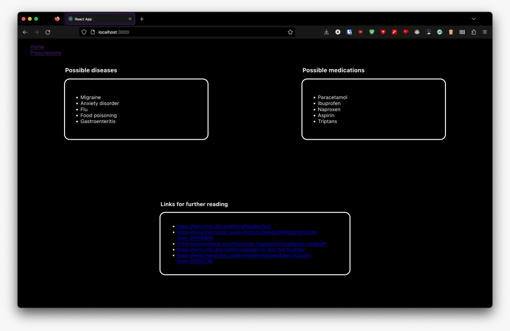

# **Diagnostic Medicine Web Application**

This program is a web application that allows users to receive an initial diagnosis of illnesses they might have, based on the symptoms that they enter into the application.

  

 

This application also keeps track of their current prescriptions to remind them when to take their medication.

The front-end of this app is built using React, hosted on Vercel, and this is found in the `front-end` branch of this repo. This connects to an API that we created that makes use of OpenAI's Da Vinci Model to retrieve information from the Internet. The back-end is built using Flask, hosted on Microsoft Azure, and is found in the `back-end` branch.

## *How to run this application*

Visit the application deployed with vercel
